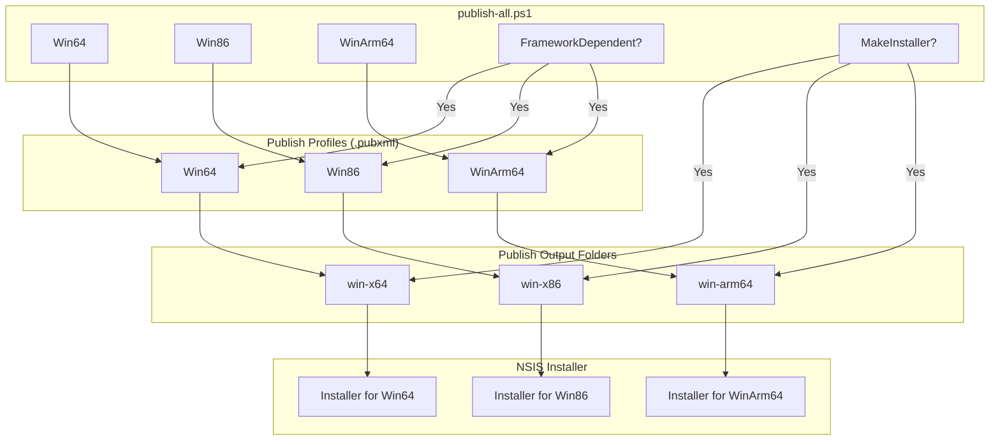

# Notepad#
A remake of [Notepad++](https://notepad-plus-plus.org/) but in C# (get it because Notepad<b>++</b> is made in C<b>++</b>, so C<b>#</b> = Notepad<b>#</b>. Very funny).
This is Windows only (like Notepad++).

## Prerequisites
- [**.NET-9**](<https://dotnet.microsoft.com/en-us/download/dotnet/9.0#:~:text=like%20Visual%20Studio).-,SDK%209.0.305,-Downloads%20for%20.NET>)
- *Optional:* [**NSIS (Nullsoft Scriptable Install System)**](https://nsis.sourceforge.io/) *(if you're wishing to build the installer)*
- Windows

## Running
To run the program it's pretty simple. Run:
```bash
dotnet run
```
in the [src](src/) folder;

## Building
You can build this project using .NET publish profiles.
### Single Platform Build
To build for a specific platform, open a terminal in the [src](src/) directory and run one of the following:
```bash
dotnet publish /p:PublishProfile=Win64
dotnet publish /p:PublishProfile=Win86
dotnet publish /p:PublishProfile=WinArm64
```
Each profile outputs to it's own folder:
```
publish/
    win-x64/
    win-x86/
    win-arm64/
```
> [!IMPORTANT]
> By default, buils are **self-contained**, meaning .NET is bundled with it. This makes the app portable but increases size.
> To make a smaller **framework-dependent** build (requires .NET runtime installed), add:
> ```bash
> --self-contained false
> ```
Example:
```bash
dotnet publish /p:PublishProfile=Win64 --self-contained false
```

### Multi-Platform Build + Installer
To build for **all three platforms**, use the included PowerShell script:
```bash
./publish-all.ps1
```
This will:
1. Publish `Win64`, `Win86`, and `WinArm64` using their `.pubxml` profiles.
2. By default, produces **self-contained** builds.
To build framework-dependent versions:
```bash
./publish-all.ps1 -FrameworkDependent
```
To **also generate NSIS installers** after publishing:
```bash
./publish-all.ps1 -MakeInstaller
```
You can combine options
```bash
./publish-all.ps1 -FrameworkDependent -MakeInstaller
```

All output paths and settings are defined in `Properties/PublishProfiles/*.pubxml`.

### Build Workflow Diagram


### NSIS Installer
Installers are built with [NSIS](#prerequisites). Make sure NSIS is installed and `makensis.exe` is in your PATH.

The script uses the `Platform` define to select the correct publish folder.
<!-- - Before you say anything yes the installer file is an almost 1:1 copy of the Notepad++ one. I wanted them as close as possible, and I didn't want to spend a long time trying to remake it. -->
- Use `/DPlatform=win-x64` (or `win-x86`, `win-arm64`) when calling `makensis` directly. e.g.:
  ```bash
  makensis /DPlatform=win-x64
  ```
- When using `./publish-all.ps1 -MakeInsaller`, the script automatically sets this for each platform.
- Use `/DFINAL` when calling `makensis` to add `/FINAL` to the compressor, reducing file size

### Running the App
After building, navigate to the output folder for your target platform:
```bash
publish/win-x64/
```
Then run:
```bash
notepad#.exe
```

### Notes
- All output paths and settings are defined in `Properties/PublishProfiles/*.pubxml`.
- The PowerShell script ensures a consistent build + installer workflow for all supported platforms.
